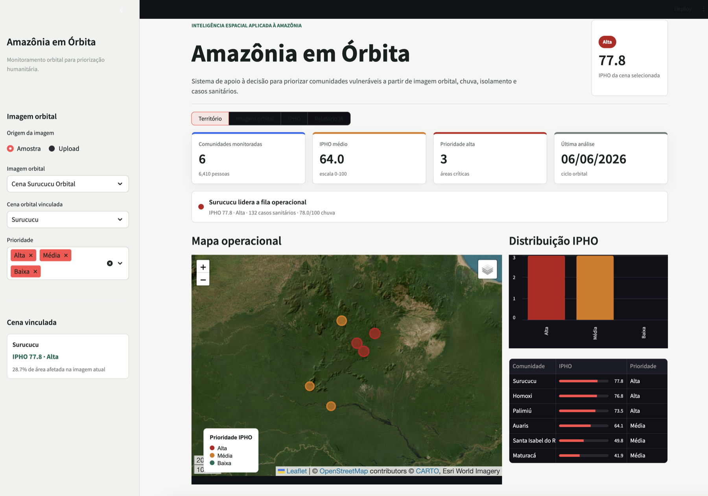
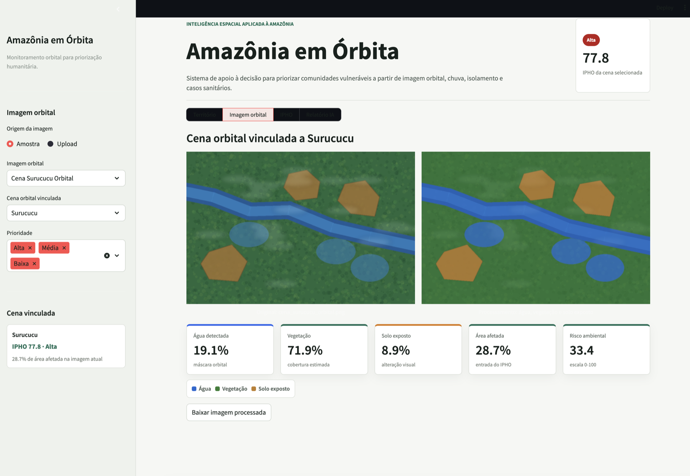
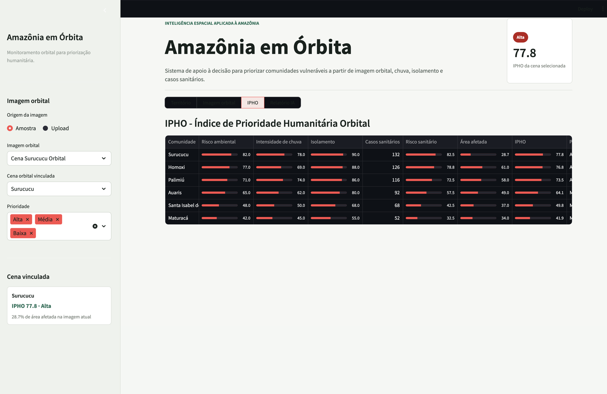
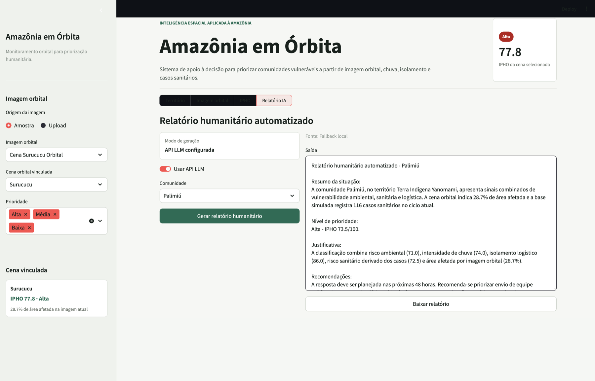

# FIAP - Faculdade de Informática e Administração Paulista
 
<p align="center">
<a href= "https://www.fiap.com.br/"></a>
</p>
 
<br>
 
# 🎓 Graduação ON em Inteligência Artificial  
 
----

# Amazônia em Órbita

Sistema inteligente para priorização de áreas vulneráveis usando imagens de satélite, risco ambiental e geração automática de relatórios humanitários.

Projeto desenvolvido para a Global Solution da FIAP, no contexto de economia espacial, inteligência artificial, visão computacional e impacto positivo na Terra.

## Integrantes

- Ana Ingrid Pires Alves Kolodji
- Fábio Santos Cardôso
- Bruno Henrique Nielsen Conter
- Matheus Conciani da Silva

## Visão Geral

O **Amazônia em Órbita** é uma prova de conceito de inteligência espacial aplicada à Amazônia. A plataforma combina imagem orbital, indicadores ambientais, risco sanitário, isolamento logístico e intensidade climática para calcular o **IPHO - Índice de Prioridade Humanitária Orbital**.

A proposta transforma dados orbitais e IA em inteligência operacional para apoiar decisões humanitárias em regiões remotas. A interface principal é um dashboard Streamlit com mapa, cards, análise de imagem, tabela de priorização e relatório humanitário automatizado.

## Problema

Comunidades isoladas da Amazônia enfrentam riscos combinados: enchentes, doenças, dificuldade logística, variação climática e baixa disponibilidade de dados operacionais. Equipes humanitárias precisam decidir onde agir primeiro, mas muitas vezes dependem de dados dispersos, baixa visibilidade territorial e relatórios manuais.

O problema central tratado pela aplicação é:

```text
Como transformar dados orbitais, indicadores ambientais e IA em inteligência operacional para priorização humanitária?
```

## Solução

O dashboard entrega quatro visões principais por um seletor persistente:

- **Território:** comunidades monitoradas, IPHO médio, áreas em prioridade alta, mapa operacional, gráfico e tabela resumida.
- **Imagem orbital:** seleção ou upload de imagem, processamento com OpenCV e detecção de água, vegetação e solo exposto.
- **IPHO:** cálculo do índice com indicadores normalizados, barras de progresso e classificação baixa, média ou alta.
- **Relatório IA:** geração de relatório humanitário com resumo, prioridade, justificativa, recomendações e próximos passos.

A navegação usa estado persistente para manter o usuário na mesma visão mesmo depois de ações que causam rerun, como gerar relatório com API LLM.

## Screenshots da Aplicação

| Território | Imagem orbital |
|---|---|
|  |  |

| IPHO | Relatório IA |
|---|---|
|  |  |

## IPHO

O IPHO combina cinco dimensões em escala de 0 a 100:

```text
IPHO =
(0.30 x risco ambiental) +
(0.25 x risco sanitário derivado dos casos) +
(0.20 x isolamento logístico) +
(0.15 x intensidade de chuva) +
(0.10 x área afetada por imagem orbital)
```

Classificação:

| IPHO | Prioridade |
|---:|---|
| 0 a 39 | Baixa |
| 40 a 69 | Média |
| 70 a 100 | Alta |

Os casos sanitários simulados são convertidos para escala de 0 a 100 antes de entrar no índice:

```text
risco_sanitario = min(100, sanitary_cases / 160 x 100)
```

## Arquitetura

```text
Imagem orbital / upload
          ↓
OpenCV: máscaras de água, vegetação e solo exposto
          ↓
Métricas visuais: área afetada e risco ambiental
          ↓
CSV de comunidades: chuva, isolamento, casos e coordenadas
          ↓
Cálculo do IPHO
          ↓
Dashboard Streamlit
          ↓
API LLM ou fallback local
          ↓
Relatório humanitário automatizado
```

## Funcionalidades

### Dashboard Streamlit

- Cabeçalho operacional com status da cena selecionada.
- Sidebar para seleção de imagem, upload, comunidade vinculada e filtro de prioridade.
- Cards de indicadores principais.
- Mapa com comunidades e marcadores coloridos por prioridade.
- Gráfico de distribuição por prioridade.
- Tabela IPHO com barras de progresso.
- Download de imagem processada e relatório.

### Análise de Imagem Orbital

O módulo de imagem usa OpenCV para:

- carregar imagem por arquivo ou upload;
- converter a imagem para HSV;
- aplicar máscaras de cor para água, vegetação e solo exposto;
- limpar ruídos com operações morfológicas;
- calcular percentuais por máscara;
- gerar imagem processada com sobreposição visual.

Na cena de amostra, o processamento identifica aproximadamente:

- 19,1% de água;
- 71,9% de vegetação;
- 8,9% de solo exposto;
- 28,7% de área afetada.

### Relatório Humanitário

O relatório gerado segue esta estrutura:

- Resumo da situação.
- Nível de prioridade.
- Justificativa.
- Recomendações.
- Próximos passos.

## IA Generativa

O cliente LLM fica em `src/orbital/llm_client.py` e usa por padrão uma API compatível com Chat Completions. A aplicação funciona mesmo sem chave, pois possui fallback local.

Crie um arquivo `.env` na raiz do projeto:

```env
LLM_API_KEY=sua_chave_aqui
LLM_MODEL=nome_do_modelo
LLM_API_URL=https://api.openai.com/v1/chat/completions
LLM_TIMEOUT_SECONDS=60
LLM_STREAM=false
LLM_MAX_TOKENS=2048
LLM_MAX_COMPLETION_RETRIES=1
LLM_REASONING_EFFORT=
```

Para Google AI Studio/Gemini:

```env
LLM_MODEL=gemini-3.5-flash
LLM_API_URL=https://generativelanguage.googleapis.com/v1beta/openai/chat/completions
LLM_TIMEOUT_SECONDS=60
LLM_MAX_TOKENS=2048
LLM_REASONING_EFFORT=low
```

Detalhes importantes do cliente:

- `LLM_STREAM=false` é o padrão recomendado para demonstração.
- Se o provedor devolver stream, o cliente acumula todos os chunks antes de renderizar o relatório.
- Se a API sinalizar `finish_reason=length`, o cliente solicita continuação automaticamente.
- O relatório só é entregue à interface quando contém as seções obrigatórias.
- Para endpoint do Google AI Studio, `reasoning_effort=low` é aplicado automaticamente quando a variável não está definida.

## Como Executar

Instale as dependências:

```bash
pip install -r requirements.txt
```

Gere novamente a imagem orbital de amostra, se necessário:

```bash
python3 src/orbital/sample_assets.py
```

Execute o dashboard:

```bash
streamlit run src/app.py
```

A aplicação normalmente abre em:

```text
http://localhost:8501
```

## Testes

Execute:

```bash
python3 -m pytest
```

Os testes cobrem:

- cálculo do IPHO;
- normalização de casos sanitários;
- ordenação por prioridade;
- análise simples de imagem orbital;
- geração de relatório local;
- prompt para LLM;
- cliente de API LLM com HTTP falso;
- stream e respostas truncadas;
- legenda do mapa.

## Estrutura do Projeto

```text
src/
  app.py
  orbital/
    app.py
    image_analysis.py
    llm_client.py
    priority_index.py
    report_generator.py
    sample_assets.py
data/
  communities_orbital.csv
  sample_images/
docs/
screenshots/
tests/
```

### Códigos Principais

| Arquivo | Responsabilidade |
|---|---|
| `src/app.py` | Entrada do Streamlit e chamada de `orbital.app.main()`. |
| `src/orbital/app.py` | Interface Streamlit, mapa, cards, tabelas, navegação e acionamento do relatório. |
| `src/orbital/image_analysis.py` | Processamento de imagem com OpenCV e extração das métricas orbitais. |
| `src/orbital/priority_index.py` | Cálculo do IPHO, normalização sanitária e classificação de prioridade. |
| `src/orbital/report_generator.py` | Relatório local, contexto quantitativo e prompt da API LLM. |
| `src/orbital/llm_client.py` | Cliente HTTP para API LLM compatível com Chat Completions. |
| `tests/test_orbital.py` | Testes principais da solução orbital. |

## Documentação e Entregáveis

- [Documentação da aplicação](docs/documentacao_aplicacao.md)
- [Manual operacional](docs/manual_operacional.md)
- [Dicionário de dados](docs/dicionario_dados.md)
- [Estrutura sugerida do PDF](docs/estrutura_pdf.md)
- [Relatório final em PDF](<docs/amazonia_em_orbita_relatorio_final (2).pdf>)

## Módulos Legados

A pasta `src/sentinela/` foi mantida como referência técnica do projeto anterior, com ingestão, banco SQLite, scheduler e modelagem sanitária. A interface principal agora é `src/app.py`, voltada ao produto **Amazônia em Órbita**.

## Link do Vídeo

Vídeo de apresentação disponível no link abaixo.
**Link do vídeo**: https://youtu.be/x0P39spT4ho?si=qQbJYVNmByXvD0Bn[https://youtu.be/x0P39spT4ho?si=qQbJYVNmByXvD0Bn]